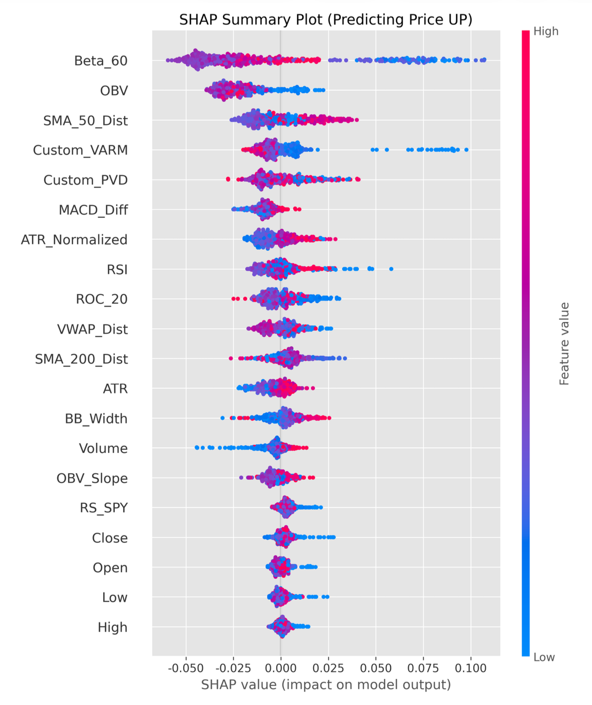
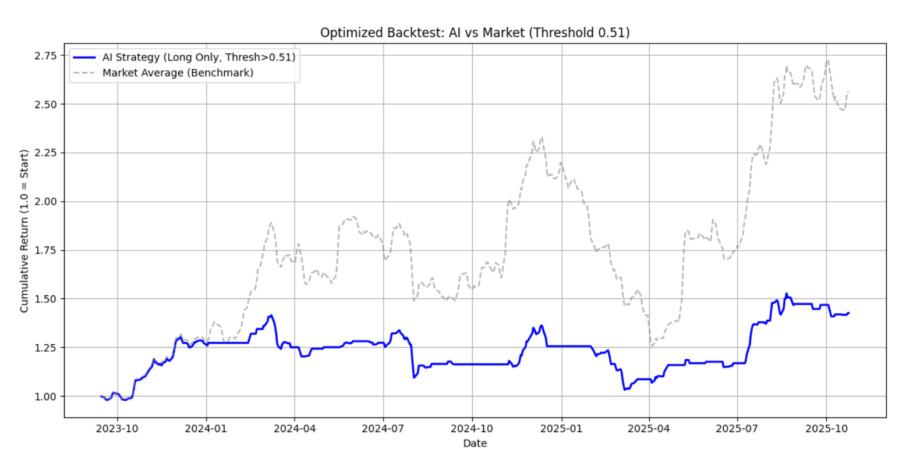

# 🛡️ Multi-Market Defensive Alpha: Machine Learning Factor Research

**👉 [Click here to read the full Research Paper (PDF)](./Multi_Asset_Factor_Research.pdf)**

## 📌 Executive Summary

This project develops a predictive machine learning trading framework spanning more than 30 assets across US equities, cryptocurrencies, and ETFs over the 2020–2025 period.[file:1] Rather than following classic trend-following paradigms, the research is centered on building a robust **defensive alpha** model that can systematically extract return while controlling downside risk.[file:1]

By designing proprietary factors and applying tree-based ensemble models, the final system behaves as a defensive contrarian: it generates returns by tilting toward low‑beta assets and selectively buying deep, volatility‑adjusted drawdowns, while preserving capital through major market dislocations.[file:1]

---

## 💡 Key Highlights & Methodology

### 1. Custom Factor Engineering

Standard off‑the‑shelf technical indicators such as RSI and MACD tend to be lagging and often fail to capture cross‑asset risk‑adjusted opportunities.[file:1] To target genuine alpha in a multi‑asset setting, this research introduces two structurally motivated custom factors grounded in financial intuition:[file:1]

- **VARM (Volatility‑Adjusted Relative Momentum)**  
  Identifies assets that are outperforming the benchmark (SPY) on a relative basis while maintaining lower volatility, penalizing high‑risk, unstable rallies.[file:1]

- **PVD (Price‑Volume Divergence)**  
  Quantifies the rolling correlation between price changes and volume to detect divergence patterns (for example, rising prices on declining volume) that often precede reversals.[file:1]

### 2. Model Selection: Bagging over Boosting

Daily financial time series are extremely noisy, making them prone to overfitting when using overly complex models such as XGBoost.[file:1] The study benchmarks Decision Tree, Random Forest (bagging), and XGBoost (boosting) classifiers on a directional 5‑day return prediction task.[file:1]

The **Random Forest** model achieves the strongest out‑of‑sample performance with an accuracy of 54.72% and the highest AUC, empirically confirming that variance reduction via bagging is more effective than bias reduction via boosting in this market regime.[file:1]

---

## 📊 Core Findings & Visualizations

### 🔍 SHAP Factor Analysis: Decoding the Alpha

The research employs SHAP (SHapley Additive exPlanations) to interpret the Random Forest model and understand how each feature contributes to predictions.[file:1]

- **Low Volatility Anomaly**  
  The 60‑day beta factor (`Beta_60`) emerges as the single most influential feature, with lower beta values strongly associated with higher probabilities of future price increases, indicating a systematic preference for defensive, low‑beta assets.[file:1]

- **Mean Reversion via VARM**  
  The custom `VARM` factor ranks among the top features in importance, and its SHAP dependence profile shows that extremely low VARM values (highly oversold relative to volatility) correspond to positive contributions to the “up” prediction.[file:1] The model therefore uses VARM primarily as a **mean‑reversion** signal, allocating to fundamentally strong assets when they become irrationally discounted.[file:1]

### 📈 Strategy Backtesting: Capital Preservation Profile

A long‑only strategy is constructed by taking positions only when the model’s predicted “up” probability exceeds a confidence threshold of 0.51, and it is benchmarked against an equal‑weight buy‑and‑hold market portfolio.[file:1]

While the AI strategy delivers a lower terminal return than the high‑beta bull market benchmark, it exhibits **materially better capital preservation**, avoiding speculative blow‑off phases and maintaining far smaller drawdowns during sharp corrections, such as those observed in mid‑2024 and 2025.[file:1]

