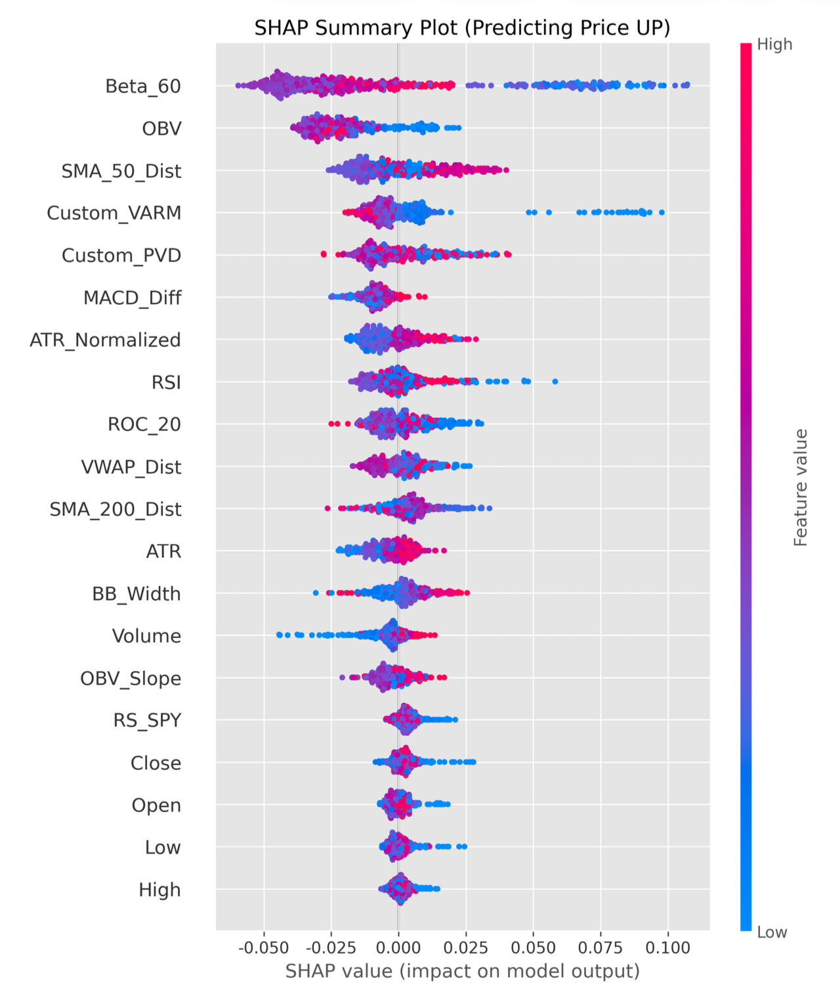
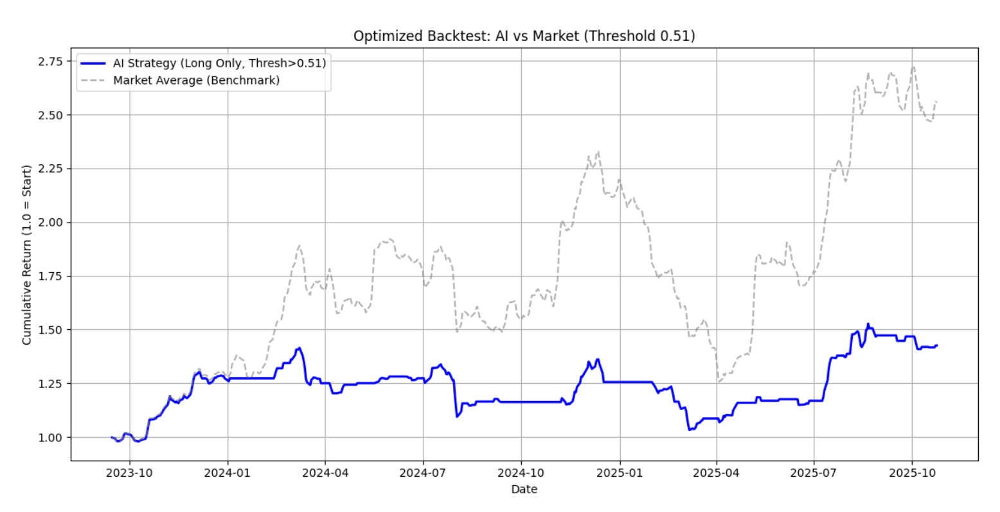

# Multi-Market Factor Research
### Machine Learning, Cross-Asset Signals, and Downside-Aware Strategy Analysis

**👉 [Read the full research paper (PDF)](./Multi_Asset_Factor_Research.pdf)**

---

## Executive Summary

This project studies whether a set of market features can provide useful predictive information across more than **30 assets** spanning US equities, ETFs, and cryptocurrencies over the **2020–2025** period.

The research is designed around a **defensive alpha** objective: rather than maximizing raw return alone, the framework evaluates whether systematic signals can improve downside characteristics while still capturing meaningful upside.

The analysis combines:

- custom factor engineering,
- tree-based machine-learning models,
- model interpretation,
- and strategy backtesting.

The resulting model tends to favor **lower-beta assets** and selected **volatility-adjusted drawdowns**, producing a more defensive allocation profile than a high-beta buy-and-hold benchmark.

The objective is not to claim a universally persistent trading edge from a single sample. The project is instead used to study how market features, model choice, and downside-aware portfolio construction interact in a noisy multi-asset setting.

---

## Research Questions

The project focuses on three questions:

1. Can structurally motivated market features improve short-horizon directional prediction across different asset classes?
2. Do simpler tree-based ensemble methods behave more robustly than higher-complexity boosting models in noisy financial data?
3. Can the resulting signals produce a more defensive return profile when translated into a trading strategy?

---

# Methodology

## 1. Custom Factor Engineering

Rather than relying only on standard technical indicators, the study develops features intended to capture economically interpretable market behavior.

Two custom factors are central to the analysis:

### VARM — Volatility-Adjusted Relative Momentum

VARM measures relative performance versus a benchmark while adjusting for volatility.

The purpose is to distinguish between:

- relatively strong but unstable price moves,
- and stronger performance achieved with lower volatility.

In the model, very low VARM values also become informative because they can identify assets experiencing unusually deep volatility-adjusted drawdowns.

---

### PVD — Price-Volume Divergence

PVD measures the rolling relationship between price changes and trading volume.

The factor is intended to capture situations where price and volume behavior diverge, such as:

- rising prices with weakening volume,
- or falling prices with improving participation.

These relationships are treated as candidate signals rather than assumed trading rules, and their usefulness is evaluated empirically within the model.

---

## 2. Model Comparison

The study compares:

- Decision Tree
- Random Forest
- XGBoost

on a **5-day directional return classification task**.

Daily financial data are noisy and prone to overfitting, so the comparison is intended to evaluate whether different ensemble structures generalize differently out of sample.

In this sample, **Random Forest produced the strongest out-of-sample classification results**, with:

- Accuracy: **54.72%**
- Highest AUC among the tested models

This result suggests that, for this dataset and feature set, variance reduction through bagging may have been more robust than the tested boosting specification.

It should not be interpreted as a general conclusion that Random Forest is superior to XGBoost across financial prediction problems.

---

# Model Interpretation

## SHAP Factor Analysis

SHAP (SHapley Additive exPlanations) is used to examine how individual features contribute to model predictions.

### Low-Beta Preference

The 60-day beta feature (`Beta_60`) emerges as one of the most influential variables in the fitted Random Forest model.

Within this sample, lower beta values are generally associated with higher predicted probabilities of positive future returns.

This is consistent with the defensive behavior observed in the strategy backtest, although the analysis does not establish that the low-volatility anomaly is the sole causal explanation.

---

### Mean-Reversion Behavior in VARM

VARM also ranks among the more influential features.

The SHAP dependence pattern shows that extremely low VARM values tend to contribute positively to the model's "up" prediction.

This suggests that the model is using part of the factor as a **mean-reversion signal**, particularly when an asset experiences an unusually deep volatility-adjusted drawdown.

---

# Strategy Backtest

A long-only strategy is constructed by taking positions when the model's predicted probability of a positive 5-day return exceeds a threshold of **0.51**.

The strategy is compared with an equal-weight buy-and-hold portfolio across the same research universe.

## Observed Behavior

The model strategy produced a **lower terminal return** than the higher-beta benchmark over the test period.

However, it also showed:

- smaller drawdowns during several correction periods,
- lower participation in speculative upside phases,
- and a more defensive allocation profile.

This trade-off is consistent with the project's original objective: studying whether predictive signals can be used to improve capital preservation rather than simply maximize total return.

---

# Interpretation

The project suggests three main observations within the tested sample:

1. **Model complexity did not automatically improve predictive performance.**  
   The tested Random Forest specification generalized better than the tested XGBoost specification.

2. **The strongest model signals were economically interpretable.**  
   Beta and volatility-adjusted relative momentum contributed meaningfully to predictions.

3. **The strategy's main advantage was defensive behavior rather than maximum return.**  
   It gave up some upside participation in exchange for smaller drawdowns during selected market corrections.

These findings are sample-dependent and should be treated as research observations rather than evidence of a persistent production-ready alpha source.

---

# Limitations

Several limitations remain important:

- The asset universe is limited and does not represent the full investable market.
- The 2020–2025 sample contains unusual market regimes, including pandemic-era dislocations and strong risk-on periods.
- Classification accuracy alone does not establish economic profitability.
- Hyperparameter selection and feature experimentation can introduce model-selection bias.
- Transaction costs, turnover, liquidity, and position sizing require further robustness analysis.
- The current study does not fully test factor stability across independent subperiods and alternative universes.
- Strong backtest behavior does not imply live-trading performance.

Future work should focus on:

- walk-forward validation,
- stricter out-of-sample testing,
- factor decay analysis,
- transaction-cost sensitivity,
- regime stability,
- and comparison with simpler rule-based baselines.

---

# Research Scope

This project is intended as a **quantitative research exercise** in factor design, model comparison, interpretability, and downside-aware strategy construction.

The goal is to understand:

- which features the model actually uses,
- whether those features have plausible financial intuition,
- how model choice changes out-of-sample behavior,
- and how predictive signals translate into portfolio-level risk characteristics.

The project should not be interpreted as a claim of a fully validated live-trading strategy.
