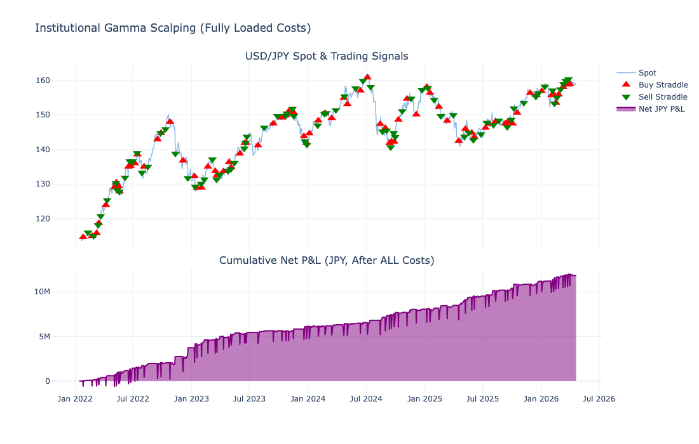
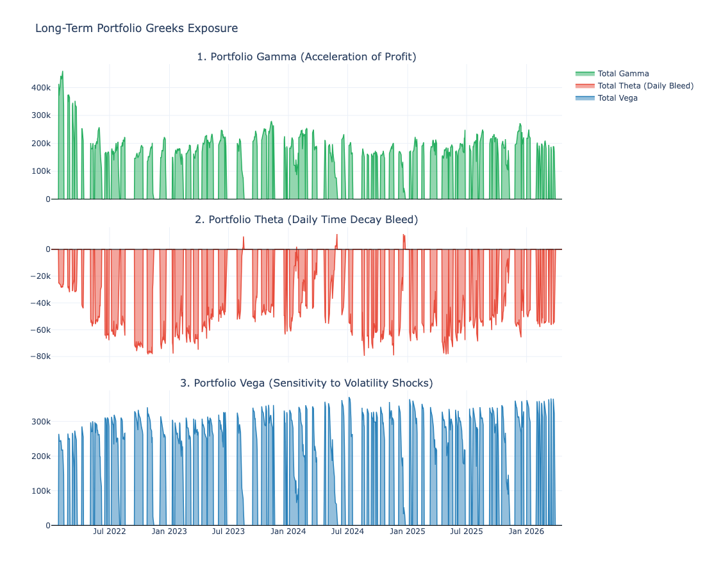

# USD/JPY Gamma Scalping Research

## Overview
This project studies an institutional-style USD/JPY gamma scalping framework designed to exploit volatility mispricing and dynamically hedge directional exposure.

## Research Focus
- Volatility mispricing detection
- Long straddle positioning logic
- Dynamic delta hedging
- Friction-aware backtesting
- Risk-adjusted performance evaluation

## Methodology
The strategy is built around a volatility-based relative value framework. When implied volatility appears statistically cheap relative to an internal benchmark, the model opens a long volatility position and dynamically hedges spot exposure. The backtest incorporates realistic trading frictions, including spread, slippage, and transaction costs.

## Key Features
- Volatility-driven trade initiation
- Dynamic hedging engine
- Transaction-cost-aware performance analysis
- Strategy diagnostics through return and risk metrics
- Greeks-based interpretation of payoff structure

## Results Snapshot
- Positive cumulative performance over the sample period
- Strong win rate and asymmetric payoff structure
- Meaningful volatility exposure with identifiable risk trade-offs
- Drawdown and Sharpe analysis included for robustness review

## Visuals
### Strategy Signals and Net P&L

### Risk / Greeks Analysis

## Notes
This repository presents a research summary version only. Certain implementation details, parameter settings, and execution logic are intentionally omitted.

## Disclaimer
For research and portfolio demonstration purposes only. Not investment advice.
